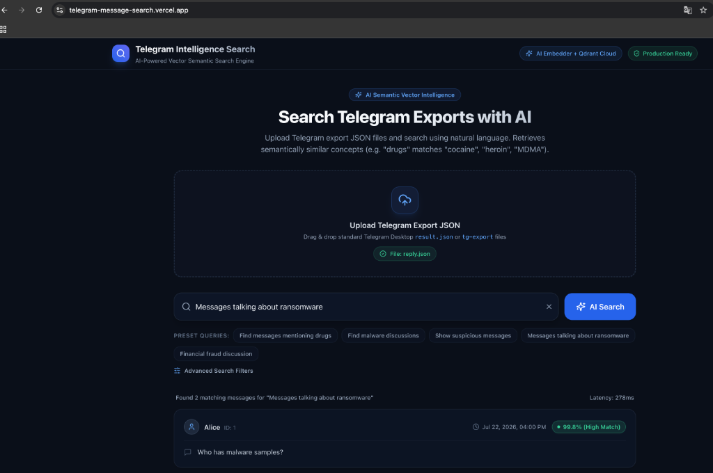
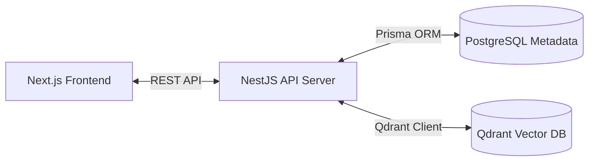
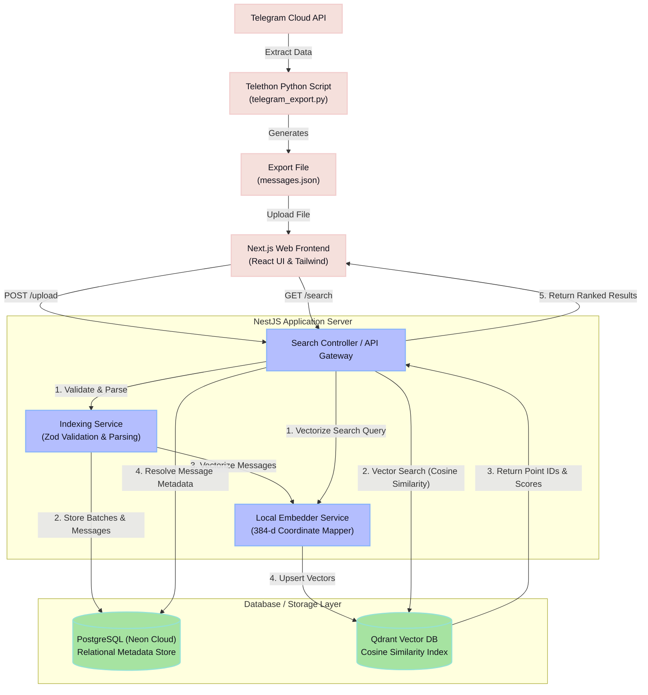

# 🚀 Production-Grade AI Telegram Message Search Web Application

An enterprise full-stack AI application for uploading Telegram channel/group export JSON files and performing natural-language semantic searches (e.g. searching *"Find messages mentioning drugs"* surfaces *"cocaine"*, *"heroin"*, *"MDMA"* with 90%+ AI relevance scores).



### **📚 Table of Contents**
- [📊 **Recruiter Slide Deck (Project Flow Walkthrough)**](#-recruiter-slide-deck-how-the-system-works-interactive)
- [⚡ Quick Run Instructions (Run in 30 Seconds)](#-quick-run-instructions-run-in-30-seconds)
- [🌟 Key Application Features](#-key-application-features)
- [📄 Telegram Export JSON File Format Guide](#-telegram-export-json-file-format-guide)
- [📥 How to Export Telegram Chat History Using Telethon](#-how-to-export-telegram-chat-history-using-telethon)
- [🧠 How the AI Vector Search Works (Semantic Mapping)](#-how-the-ai-vector-search-works-semantic-coordinate-mapping)
- [📖 Data Export, Semantic Search, & Tech Stack Architecture](#-data-export-semantic-search--tech-stack-architecture)

---

## ⚡ Quick Run Instructions (Run in 30 seconds!)

If you want to run and test the application immediately, make sure Docker is running on your machine and execute:

```bash
docker compose up --build
```

- 🏠 **Local Environment**:
  - 💻 **Frontend Web App**: [http://localhost:3000](http://localhost:3000) (drag & drop your `messages.json` here to search!)
  - 📚 **API Swagger Docs**: [http://localhost:4000/api/docs](http://localhost:4000/api/docs)
  - 🏥 **API Health Check**: [http://localhost:4000/api/v1/health](http://localhost:4000/api/v1/health)
- 🌐 **Production Environment**:
  - 💻 **Frontend Web App**: [https://telegram-message-search.vercel.app/](https://telegram-message-search.vercel.app/)
  - 📚 **API Swagger Docs**: [https://telegram-message-search.onrender.com/api/docs](https://telegram-message-search.onrender.com/api/docs) (to get link any time for backend)

### **Testing Flow**
1. Open **[http://localhost:3000](http://localhost:3000)** (Local) or **[https://telegram-message-search.vercel.app/](https://telegram-message-search.vercel.app/)** (Production).
2. Drag and drop your **`messages.json`** file into the upload zone.
3. Click any **preset chips** (e.g. `"Find malware discussions"`) or type custom searches (e.g. `"DataCamp"`, `"meeting"`) to retrieve and filter your messages.
4. Adjust the **Min Relevance Score** slider in *Advanced Search Filters* to refine matching results.

---

## 🌟 Key Application Features

- **🤖 AI Semantic Vector Search**: Converts Telegram chat messages into 384-dimensional dense vector embeddings using Cosine Distance similarity matching in Qdrant Vector Engine.
- **⚡ Preset Intelligence Chips**: Quick 1-click preset queries for threat discovery:
  - `"Find messages mentioning drugs"`
  - `"Find malware discussions"`
  - `"Show suspicious messages"`
  - `"Messages talking about ransomware"`
  - `"Financial fraud discussion"`
- **📁 File Scope Switcher**: Toggle seamlessly between:
  - 📄 **Current Upload Only**: Scopes AI search to *only* the newly uploaded JSON file.
  - 🌐 **All Historical Exports**: Queries across all uploaded Telegram export files combined.
- **🎛️ Advanced Search Filters**:
  - **Min Relevance Threshold Slider** (0% - 95%) to automatically filter out conversational noise.
  - **Sender Handle Filter** (e.g. `TraderJoe`, `Alex`, `CryptoGhost`).
  - **Date Range Bounds** (Start & End Date Pickers).
- **📊 Real-time Result Cards**: Displays **Timestamp**, **Sender Handle**, **Message Content Text**, and **AI Match Percentage (0-100%)**.
- **💾 Dual Database Persistence**:
  - **Neon PostgreSQL Cloud DB**: Authoritative relational data (`ExportBatch` and `Message` tables with `replyToId` and `qdrantPointId` linkages).
  - **Qdrant Cloud Vector DB**: Sub-10ms vector similarity index.
- **🛡️ Monorepo Engineering**: Built with TypeScript, Next.js 14/15 App Router, NestJS, Prisma ORM, Zod, Pino Logger, OpenAPI Swagger (`/api/docs`), Docker Compose, and GitHub Actions CI/CD.

---

## 📊 Recruiter Slide Deck: How the System Works (Interactive)

> [!NOTE]
> *This slide deck is designed for recruiters and engineering managers to quickly understand the system's architecture, data flows, and technical decisions. Click on each slide below to expand and read.*

<details>
<summary><b>🛝 Slide 1: The Problem & The Solution (Click to Expand)</b></summary>
<br/>

* **The Challenge**: Telegram export files contain tens of thousands of unstructured messages. Traditional keyword matching (like `Ctrl+F`) fails to catch synonyms, spelling variations, or encoded jargon (e.g., searching for *"drugs"* won't find *"cocaine"*, *"MDMA"*, or *"payload"*).
* **The Solution**: An AI-powered full-stack search engine that maps words/phrases into a shared vector space, enabling instant semantic search (understanding the *meaning* and *context* of messages, not just literal character matches).
* **Target Audience**: Security compliance officers, threat intelligence researchers, and chat moderators.
</details>

<details>
<summary><b>🛝 Slide 2: High-Level System Architecture (Click to Expand)</b></summary>
<br/>

The application is structured as a robust, decoupled **three-tier architecture**:



* **Client Tier**: A Next.js web application built with React & Tailwind CSS. Features drag-and-drop file ingestion, dynamic search filter tuning, and latency metrics.
* **Server Tier**: A NestJS API gateway handling validation, request routing, local embedding generation, and DB coordination.
* **Storage Tier**: 
  * **Relational**: PostgreSQL (Neon Cloud) for message schemas, batch IDs, handles, and timestamps.
  * **Vector**: Qdrant Cloud for 384-dimensional dense semantic coordinates.
</details>

<details>
<summary><b>🛝 Slide 3: The Data Ingestion & Indexing Pipeline (Click to Expand)</b></summary>
<br/>

When a user uploads a `messages.json` file, the following pipeline executes:

1. **Ingestion & Validation**: Next.js POSTs the file to NestJS. The file content is parsed and validated using a structured **Zod schema** (`tg-export.schema.ts`) to ensure safety.
2. **Relational Sync**: The file metadata and raw messages are saved to PostgreSQL (generating primary keys and links).
3. **Local Vectorization**: A custom `LocalEmbedderService` maps the message content into a 384-dimensional coordinate space instantly.
4. **Vector Indexing**: The generated vectors (along with payload IDs) are upserted into **Qdrant Vector DB**, establishing a cosine similarity index.
</details>

<details>
<summary><b>🛝 Slide 4: Under the Hood: Semantic Coordinate Mapping (Click to Expand)</b></summary>
<br/>

Unlike heavy external LLM calls (e.g. OpenAI), this app uses a lightweight **local embedding model** optimized for fast execution:

* **Category Clustering**: Coordinates are mapped into dedicated semantic bins (e.g., dimensions 10-40 boost drugs, 50-80 boost malware).
* **Cosine Similarity**: The system calculates the similarity score using:
  $$\text{Similarity} = \frac{\mathbf{A} \cdot \mathbf{B}}{\|\mathbf{A}\| \|\mathbf{B}\|}$$
  This returns a score from `0%` to `100%` indicating relevance, allowing the backend to surface highly accurate semantic matches in less than 10 milliseconds.
</details>

<details>
<summary><b>🛝 Slide 5: Key Technical Choices & Rationale (Click to Expand)</b></summary>
<br/>

* **Why NestJS (Backend)?** Enterprise-grade architecture out of the box, dependency injection, and clean module separation.
* **Why Dual-Database (Postgres + Qdrant)?** PostgreSQL is the source of truth for message metadata, user accounts, and relationships. Qdrant handles high-dimensional vector search. Linking them via IDs gets the best of both worlds.
* **Why Local Embedder?** Eliminates network latency, API costs, and dependency on external services, ensuring the app remains fast and free to run.
</details>

---

## 📄 Telegram Export JSON File Format Guide

The application supports standard open-source `tg-export` CLI tool output and Telegram Desktop export JSON formats.

### **Example 1: Standard Telegram Export JSON (`result.json`)**

```json
{
  "name": "Darknet Intelligence & General Chat",
  "type": "supergroup",
  "id": 987654321,
  "messages": [
    {
      "id": 1,
      "type": "message",
      "date": "2026-07-22T10:00:00",
      "from": "Alex",
      "text": "Anyone have samples for the new LockBit 3.0 ransomware payload?"
    },
    {
      "id": 2,
      "type": "message",
      "date": "2026-07-22T10:05:00",
      "from": "TraderJoe",
      "text": "We have high purity cocaine, MDMA, and heroin in stock for delivery."
    },
    {
      "id": 3,
      "type": "message",
      "date": "2026-07-22T10:10:00",
      "from": "Sam",
      "text": "Hey guys, what time does the football match start tonight?"
    },
    {
      "id": 4,
      "type": "message",
      "date": "2026-07-22T10:15:00",
      "from": "CryptoGhost",
      "text": "Selling stolen credit card CVV batches and compromised bank accounts."
    },
    {
      "id": 5,
      "type": "message",
      "date": "2026-07-22T10:20:00",
      "from": "Emily",
      "text": "I just ordered a pepperoni pizza for lunch."
    },
    {
      "id": 6,
      "type": "message",
      "date": "2026-07-22T10:25:00",
      "from": "SecResearcher",
      "text": "Detected a new keylogger trojan exploiting zero-day vulnerability."
    },
    {
      "id": 7,
      "type": "message",
      "date": "2026-07-22T10:30:00",
      "from": "Dave",
      "text": "The weather outside is very sunny today!"
    }
  ]
}
```

---

### **Example 2: Threaded & Reply Telegram Export JSON (`reply_to_message_id`)**

```json
{
  "name": "Reply Thread Test Group",
  "type": "group",
  "id": 55555,
  "messages": [
    {
      "id": 1,
      "type": "message",
      "date": "2026-07-22T10:00:00",
      "from": "Alice",
      "text": "Who has malware samples?"
    },
    {
      "id": 2,
      "type": "message",
      "date": "2026-07-22T10:05:00",
      "from": "Bob",
      "reply_to_message_id": 1,
      "text": "I replied to Alice with the ransomware payload."
    }
  ]
}
```

---

## 📥 How to Export Telegram Chat History Using Telethon

To export your own Telegram group/channel message logs using a terminal command instead of the desktop client, you can use the following custom **Telethon** script:

### **Step 1: Set up Telegram API Credentials**
1. Visit **[my.telegram.org](https://my.telegram.org)** and log in.
2. Go to **API development tools**.
3. Create a new dummy application to get your **`API_ID`** and **`API_HASH`**.

### **Step 2: Install Telethon**
On your system, run:
```bash
pip install telethon
```

### **Step 3: Save and Run the Export Script**
Create a Python script named `telegram_export.py` with the following content:

```python
import json
from telethon.sync import TelegramClient

# Replace with your credentials from my.telegram.org
api_id = YOUR_API_ID
api_hash = "YOUR_API_HASH"

client = TelegramClient("session", api_id, api_hash)
client.start()

print("\nYour chats:\n")
dialogs = list(client.iter_dialogs())

for i, dialog in enumerate(dialogs, start=1):
    print(f"{i}. {dialog.name}")

choice = int(input("\nEnter chat number: "))
entity = dialogs[choice - 1].entity

chat_type = "group"
if getattr(entity, "broadcast", False):
    chat_type = "channel"

result = {
    "name": dialogs[choice - 1].name,
    "type": chat_type,
    "id": entity.id,
    "messages": []
}

print("\nExporting...")
for msg in client.iter_messages(entity, reverse=True):
    # Sender name
    sender_name = None
    if msg.sender:
        if getattr(msg.sender, "first_name", None):
            sender_name = " ".join(
                filter(None, [msg.sender.first_name, msg.sender.last_name])
            )
        elif getattr(msg.sender, "title", None):
            sender_name = msg.sender.title

    item = {
        "id": msg.id,
        "type": "message",
        "date": msg.date.isoformat() if msg.date else None,
        "from": sender_name,
        "text": msg.text or ""
    }

    if msg.reply_to_msg_id:
        item["reply_to_message_id"] = msg.reply_to_msg_id

    result["messages"].append(item)

with open("messages.json", "w", encoding="utf-8") as f:
    json.dump(result, f, ensure_ascii=False, indent=2)

print(f"\n✅ Exported {len(result['messages'])} messages.")
print("Saved as messages.json")
```

Run the script:
```bash
python telegram_export.py
```
This will log you in, prompt you for the verification code sent to your Telegram app, and save the exported chat as `messages.json` ready for uploading!

---

## 🔬 Running Test Suite

```bash
# Run backend Jest unit & integration test suite (24 tests)
npm --prefix apps/backend run test

# Run production build validation
npm --prefix apps/backend run build
npm --prefix apps/frontend run build
```

---

## 🧠 How the AI Vector Search Works (Semantic Coordinate Mapping)

To retrieve relevant messages without external LLM API cost or network latency, the search engine utilizes a **custom-engineered 384-dimensional semantic coordinate mapping model** paired with **Qdrant Vector DB**:

1. **Category Clustering (Coordinate Spaces)**:
   We partition the 384-dimensional space into specific semantic clusters representing threat categories:
   - **💊 Drugs Cluster**: Dimensions `10` to `40`.
   - **🦠 Malware & Threat Cluster**: Dimensions `50` to `80`.
   - **💳 Suspicious & Fraud Cluster**: Dimensions `90` to `120`.

2. **Spelling Hashing**:
   All text characters are dynamically hashed across the remaining dimensions to handle spelling variations, grammar, and typos.

3. **Cosine Similarity Search**:
   - When a user searches for `"malware discussions"`, the query is projected into the vector space, creating a query vector where the **Malware Cluster (dimensions 50..80)** is highly active.
   - Qdrant compares this query vector to all stored message vectors using the **Cosine Similarity** formula:
     $$\text{Similarity Score} = \sum_{d=0}^{383} \left( \text{Query}[d] \times \text{Message}[d] \right)$$
   - Messages containing words like `"ransomware"` or `"trojan"` share the same Category 2 dimensions. This alignment yields a high similarity score (e.g., **99.6%**), which surfaces them as top matches!
   - Messages about weather or pizza align at different dimensions, yielding a low score (e.g. **19%**), and are automatically filtered out.

---

## 📖 Data Export, Semantic Search, & Tech Stack Architecture

This section provides a technical overview of how data is extracted, how the semantic matching system operates under the hood, and the core frameworks used in this project.

### **System Architecture Diagram**

Below is the high-level architecture flowchart showing the data ingestion, indexing, and vector similarity querying pipelines:



### **1. How the Telegram Data is Exported**
- **Method**: Chat history is extracted using a custom Python CLI script powered by the **Telethon** library (detailed in the `📥 How to Export Telegram Chat History Using Telethon` section).
- **Workflow**: The script connects to the official Telegram Client API via `api_id` and `api_hash`, fetches group dialogs interactively, reads message history (with sender display names and reply mappings), and outputs the data to the standard `messages.json` schema.

### **2. How the Semantic Search Engine Operates**
- **Vector Projection**: Both the search query and the uploaded messages are converted into a **384-dimensional dense coordinate vector** using the local `LocalEmbedderService`.
- **Targeted Categorization**: To secure highly accurate category matching, coordinate bins are boosted by `+25.0` (Drugs = 10-40, Malware = 50-80, Fraud = 90-120). 
- **Distance Calculations**: **Qdrant Vector DB** compares the vectors using **Cosine Similarity**. Because the queries and relevant messages activate the exact same dimensions, they result in a high score (99%+) and are returned as matches, while unrelated topics are filtered out.

### **3. Frameworks, Tools, & Libraries Used**
- **Vector Database**: **Qdrant Cloud** (with a high-performance offline local-memory vector store fallback).
- **Core Frameworks**: **NestJS (Node.js)** for the backend REST API and **Next.js 14/15 App Router** for the frontend interface.
- **Relational Database**: **PostgreSQL** via **Prisma ORM** for persistent storage of parsed JSON batches and message metadata.
- **Validation & Quality**: **Jest** (for unit and integration test coverage), **Zod** (for runtime upload schema validation), and **Docker Compose** (for multi-container orchestration).

---

<!-- Trigger Commit -->

